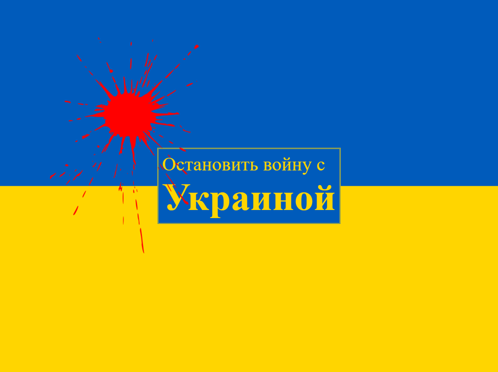

# 🟦 Stop war on Ukraine 🟨

**As a libertarian and programmer,** I would never think that I would someday work on a piece of software that would go against free access to any service from any corner of the world.

But unfortunately, the situation has changed.

Ukraine was attacked by Russia and a lot of innocent children, women and men are now dying in Kyiv and other Ukrainian cities at the hands of one cruel dictator.

**This can not be tolerated in 21. century in Europe.**

We can not just close our eyes and just provide all services and benefits to the Russian economy which can keep killing innocent people.

**If you are managing some website, please stop it for Russia** until the war will be over and putin overthrown.

---

I don't want to punish the Russian people as a whole. As a citizen of Prague, I have few Russian friends and this definitely won't change. I believe most Russians do not support the politics of their state and especially this cruel war. But unfortunately, economic pressure is now one of the less bad solutions. And every ruble paid on taxes for the current Russian government means more money for killing innocent people.

---

I have created a simple way how to do it.

For the users **from other places, nothing happens**. The script is tiny to load and insignificant. If the visitor is from **Russia or Belarus** _(detected by system language)_ this **message will appear**:

https://github.com/hejny/Ukraine

<!--Badges-->
<!--⚠️WARNING: This section was generated by https://github.com/hejny/batch-project-editor/blob/main/src/workflows/800-badges/badges.ts so every manual change will be overwritten.-->
<!--
[](https://github.com/hejny/Ukraine/blob/main/LICENSE)
[](https://www.npmjs.com/package/Ukraine)
[](https://packagequality.com/#?package=Ukraine)
[](https://github.com/hejny/Ukraine/actions/workflows/lint.yml)
[](https://github.com/hejny/Ukraine/actions/workflows/test.yml)
[](https://snyk.io/test/github/hejny/Ukraine)
[](https://github.com/hejny/Ukraine/issues)
-->
<!--/Badges-->



## 📲 How to include on your page?

There are several ways how to add this to your page:

### 📔 Via HTML script tag

<!-- TODO: Auto update of version v0.13.0 -->

```html
<script src="https://cdn.jsdelivr.net/npm/save-ukraine@0.13.0/dist/umd/main.js"></script>
<script>
    Ukraine.save();
</script>
```

_Note:_ You can [also modify the options](https://github.com/hejny/Ukraine/blob/main/samples/browser.html#L10).
_Note: Normally you would include **async** and **defer** keywords in the script element. But in this situation we do not want to defer this miniscript._

### 📘 Import into the bundle

First, you need to install [save-ukraine package from NPM](https://www.npmjs.com/package/save-ukraine):

```bash
npm i save-ukraine
```

And then use:

```typescript
import Ukraine from 'save-ukraine';

Ukraine.save();
```

_Note: This library is written in TypeScript so [options](./src/options.ts) are fully typed._

<!--
### 📗 Wordpress, ...
Feel free to add more methods of importing
-->

## 🛑 How not to use?

There are some ways to beware of

### 👨🏽‍💻 Security

When you import anything _(not only this script)_ on your page, please do not trust the publisher. Verify the code and **include only the specific version** not the wildcard of every future version.

<!--

TODO:

### 👽 Import via

Do not use - caniuse for Russia
<script type="module">
    import Ukraine from '../dist/esm/Ukraine.js';

    console.log(
        Ukraine.default(`

          ✂️ Ukraine as ES module ✂️

    `),
    );
</script>

-->

## 🛠 Customization

You can customize what will be shown.
Here are all the [options](./src/options.ts). If you have some idea feel free to contribute via pull request.

```javascript
Ukraine.save({
    text: 'Stop the war with <b>Ukraine</b>',
    countries: [/* Russia and Belarus */ 'ru', 'by'],
    isBloodIncluded: true,
});
```

## 🎭 Scenarios

!!!
### I just want to add

### I want to block

### I want to block


## ⁉️ Questions & FAQ


Few most common things aggregated from your questions:

---

> How do you detect whether the user is or isn't from Russia.

We are capturing `navigator.language` from the browser. [Full implementation is here](https://github.com/hejny/Ukraine/blob/main/src/getUserLanguage.ts).


---

> How do you block the page?

I am putting a fixed full-screen div with a big z-index + restricting overflow and pointer-events for the rest of the page.


---

> This restriction can be easily avoided!

Yes and no. For litter more skilled user on the desktop, it can be. For most of the users not.
They can also switch their language but my goal is not to be bulletproof 100% blocking. But just to show this important message for Russian citizens.

---

> This will also restrict Russian-speaking people from Ukraine?

Unfortunately, probably yes. Please do not place this for some essential services for Ukrainian people which can help them survive the war, like news, instructions, maps, ...
There is no way how to perfectly detect who the user is and **there will be always false positives and false negatives**.

But if you have some better solution for this issue, [please share with me](https://github.com/hejny/Ukraine/issues/13).

---

> It makes no sense to block western information from Russian people!

**Definitely!** If you are maintaining news and telling truth about the war / putin, please do not block it for the Russian people.
This tool should be used as part of economic and social sanctions to Russia but made from the bottom. So, if you have some professional tool, some war/politics unrelated topic, unrelated blog, e-shop, crypto tool... you can use it as your personal economic sanctions.

Not to punish Russian people but to increase the efficiency of economic sanctions and help to get rid of the current Kremlin regime.

---

> Can I change this and that?

**Definitely!** Please make a [pull request](https://github.com/hejny/Ukraine/pulls).

